# ADOM Project Context — D-5 PoC Single Source of Truth

> 상태: **ACTIVE / 발표 시연 우선**
> 기준일: **2026-08-12**
> 권위: 이 파일이 ADOM의 유일한 프로젝트 Source of Truth다. 기존 설계 문서나
> 회의 기록과 충돌하면 이 문서를 우선한다.
> 변경 규칙: 범위, 인터페이스, 담당자, 성공 기준을 변경할 때는 이 파일의
> `Decision Log`에 날짜·결정·이유를 함께 기록한다.

## 0. 문서 운영 계약

문서는 아래 순서로 해석한다. 하위 문서가 상위 문서와 충돌하면 상위 문서를 따른다.

1. **이 파일:** 지금 유효한 범위, 시스템 계약, 책임, 성공 기준
2. **Accepted decision record:** 결정 당시의 근거와 대안; 현재 상태는 이 파일 기준
3. **Project status:** 실제 완료율, blocker, evidence, 다음 hand-off
4. **Experiment protocol/run record:** 재현 가능한 연구 조건과 결과
5. **Meeting/AI collaboration note:** 논의 출처이며 그 자체로 승인된 결정은 아님

운영 링크:

- [Docs hub](docs/README.md)
- [Project status dashboard](docs/status/README.md)
- [D-5 PoC live status](docs/status/d5-poc.md)
- [Decision record index](docs/decision-records/README.md)
- [AI collaboration notes](docs/ai-collaboration/README.md)

상태 문서에는 계획을 복제하지 않고 `완료/진행/막힘`, evidence와 다음 행동만 쓴다.
회의나 AI 대화가 범위·계약을 바꾸면 대화 노트만 남겨서는 안 되며, 같은 변경에서
이 파일과 decision record를 함께 갱신한다. 추측값은 `제안/미검증`으로 표시하고
담당자가 실측한 뒤에만 `검증됨`으로 바꾼다.

GitHub 작업은 요청된 변경을 commit·push하면 사용자가 명시적으로 PR 생성을 금지하지
않는 한 별도 요청을 기다리지 않고 PR을 연다. PR은 기본적으로 Ready for review로
공개한다. RunPod·Jetson·장시간 검증 등 아직 수행하지 못한 항목은 PR 본문의 명시적
merge blocker로 관리하며, 그 사실만으로 Draft로 두지는 않는다. Draft는 사용자가
요청했거나 변경 자체가 아직 review 가능한 단위가 아닐 때만 사용한다.

## 1. 프로젝트 개요

ADOM은 산악·오프로드 환경의 1/10 RC Car에서 카메라 기반 semantic perception이
차량의 안전 정지로 이어지는 end-to-end 온보드 파이프라인을 시연한다.

### 현재 post-D-5 개발 범위

인지 모델이 동작하는 현재 increment는 복잡한 global navigation 대신 robot-frame
Semantic20 costmap에서 실행되는 저수준 방향 tree planner를 사용한다. planner는
Ackermann 가능한 좌/직진/우 방향을 다단계로 전개하고 매 cycle 첫 방향만 실행해
직진과 근거리 장애물 회피를 수행한다. GPS는 localization, planning, control 입력으로
사용하지 않고 이동경로 기록과 rosbag 분석에만 사용한다.

자율주행 세션은 perception 판단, semantic costmap, 선택 path/tree 상태, `/cmd_vel`,
`/drive`, PWM 상태, IMU, raw GPS fix와 logging-only GPS trail을 bounded rosbag으로
기록한다. Semantic20 mask는 판단 재현을 위해 포함하지만 고대역폭 confidence와 BGR
overlay는 live autonomy bag에서 제외한다. 기존 RGB-only 학습 데이터 수집 bag과
autonomy evidence bag은 목적과 저장 경로를 분리한다. 상세 계약은 decision records
0010과 0011을 따른다.

현재 집중연구기간은 5일이며, 이 기간의 최우선 목표는 연구 novelty나 최고 성능이
아니라 **재현 가능하고 안전한 라이브 PoC**다. 모델 고도화, Semantic23 통합,
웹 기반 MLOps 자동화, depth 기반 costmap과 Nav2 통합은 발표 시연 이후로 연기한다.

### 현재 확보 자산

- MMSegmentation 1.2.2 기반 Semantic20 학습·평가 파이프라인
- RELLIS 기반 SegFormer-B0/B2 E0 checkpoint
- RunPod 학습·resume·W&B·고정 split 및 metric contract
- Jetson Orin Nano 8GB, ZED 2i, PCA9685 PWM, 배터리가 장착된 RC Car
- ROS 2 control node, gamepad manual/autonomous/stop mode, command watchdog
- 640x384 ONNX export 설정과 PyTorch↔ONNX logits parity 검사

### 아직 구현되지 않은 핵심 구간

- TensorRT engine 및 Jetson standalone inference
- `adom_perception_ros` 실제 inference node
- target mask에서 Go/Stop을 결정하는 safety-reflex node
- perception→`/drive/autonomous`→PCA9685 end-to-end 검증
- 신규 target-class 촬영·CVAT 라벨·short fine-tuning

## 2. D-5 Definition of Done

### 필수 성공 조건

1. ZED 2i RGB frame이 Jetson의 SegFormer-B0 FP16 TensorRT engine으로 입력된다.
2. target-class mask와 ROI 판정 값이 ROS topic으로 발행된다.
3. target이 중앙 safety corridor에 진입하면 차량이 0.3 m/s 이하에서 정지한다.
4. perception/control message가 끊기면 0.25초 이내 neutral PWM으로 복귀한다.
5. E0의 실패와 신규 fine-tuned 모델의 성공을 같은 고정 장면에서 촬영한다.
6. 신규 학습이 실패해도 아래 fallback 중 하나로 발표 가능한 PoC를 보존한다.

### 비목표

- 완전 자율 경로계획 또는 Nav2 navigation
- 조향 회피; D-5 성공 조건은 **정지**까지다.
- ZED depth, point cloud, VIO, 3D/BEV costmap
- LoRA, adapter, 새 backbone/decoder
- INT8 calibration 또는 dynamic-shape engine
- uncertainty/OOD 보장, 물리적 traversability 예측
- 야간·경사·완전 가림 문제 해결 주장
- 웹 대시보드와 배포 자동화

## 3. D-5 시연 시나리오와 타겟 클래스

### 3.1 현재 상태: target 미동결

E0 B0의 19-class Semantic20 출력을 실제 ZED/현장 후보 장면에서 먼저 시각화한 뒤
fine-tuning 및 Go/Stop target을 선택한다. Baseline ONNX/TensorRT는 특정 class만
추론하거나 제거하지 않고 ID `0..18` 전체 logits와 argmax mask를 보존한다.

target 선택 전에는 자동 STOP 판정을 활성화하지 않는다. 다음 evidence를 함께 보고
한 class를 동결한다.

- 현장 영상에서 일관되게 실패하거나 recall이 낮은가
- 군사·오프로드 안전 시나리오와 설명 가능한가
- 안전하게 반복 배치·촬영·라벨링할 수 있는가
- resize/padding 뒤에도 충분한 pixel area가 남는가
- negative scene에서 false stop을 통제할 수 있는가

### 3.2 탐색 후보

`log`, `pole`, `rubble`, `barrier`, `mud` 등은 과거 정량 결과를 이용한 탐색 후보이며
현재 기본 target이 아니다. E0 baseline의 1–3개 sample overlay와 per-class ROI 면적,
현장 실패 장면을 확인한 뒤 선택한다. canonical split에 GT가 없는 class는 해당 split
IoU만으로 배제하거나 채택하지 않는다.

### 3.3 선택 후 계약

target을 동결하면 class ID, 시나리오, 선택 evidence, ROI, threshold, annotation 범위,
held-out test를 이 문서와 새 decision record에 함께 기록한다. 그 전까지 target별
수치와 topic은 제안으로만 취급한다.

## 4. 정지 판정 계약

전체 화면의 단순 5% threshold를 사용하지 않는다. 영상 하단 중앙의 고정
`safety corridor`에서 target connected component를 평가한다.

초기 파라미터는 validation 영상에서만 조정하고 최종 촬영 전에 동결한다.

| 항목 | 초기값 | 규칙 |
| --- | ---: | --- |
| 최대 자율 속도 | 0.30 m/s | 실제 속도는 open-loop이므로 저속 실측 필요 |
| target | 미동결 | Semantic20 IDs 0..18 전체를 먼저 검토 |
| ROI | 하단 중앙 trapezoid 후보 | padding 제외 source-image 좌표로 카메라 장착 후 고정 |
| target area ratio | 미동결 | 선택 class validation에서 조정 |
| stop debounce | 3 frames | 연속 충족 시 STOP |
| release debounce | 5 frames | 발표 시 자동 release 대신 수동 reset 권장 |
| command timeout | 0.25 s | timeout 시 neutral |

target·ROI·threshold 동결 전에는 inference/ROI를 관찰 모드로만 실행한다. 동결 뒤에도
STOP 이후 자동 재출발은 금지하고 운영자가 scene을 확인해 mode를 다시 선택한다.

## 5. D-5 파이프라인 아키텍처

```mermaid
flowchart LR
    A["ZED 2i RGB"] --> B["Verified Preprocess / Candidate 640x384"]
    B --> C["SegFormer-B0 TensorRT FP16"]
    C --> D["Semantic20 Argmax Mask"]
    D --> E["Selected-class ROI / Temporal Debounce"]
    E --> F["Go/Stop Safety Reflex"]
    F --> G["/drive/autonomous"]
    G --> H["Existing Gamepad Mode Mux"]
    H --> I["/drive"]
    I --> J["PCA9685 PWM"]
```



### ROS 최소 인터페이스

새 custom message는 D-5 이후로 연기하고 표준 message만 사용한다.
아래 topic은 구현을 시작하기 위한 **제안 계약**이며, 실제 설치된 ZED wrapper와
control node에서 담당자가 검증하기 전까지 확정값으로 간주하지 않는다.

| 데이터 | 제안 topic | type | 검증 담당 | 상태 |
| --- | --- | --- | --- | --- |
| ZED rectified RGB | `ros2 topic list -t` 결과로 확정 | `sensor_msgs/Image` | 명섭 | 미검증 |
| semantic mask | `/adom/perception/semantic_mask` | `sensor_msgs/Image` (`mono8`) | 가형 | 제안 |
| target area ratio | `/adom/perception/target_area_ratio` | `std_msgs/Float32` | 가형 | 제안 |
| target detected | `/adom/perception/target_detected` | `std_msgs/Bool` | 가형·명섭 | 제안 |
| autonomous command | `/drive/autonomous` | `ackermann_msgs/AckermannDriveStamped` | 명섭 | 저장소 코드 기준, 실기 검증 필요 |
| final actuator command | `/drive` | `ackermann_msgs/AckermannDriveStamped` | 명섭 | 저장소 코드 기준, 실기 검증 필요 |
| emergency stop | `/emergency_stop` | `std_msgs/Bool` | 명섭 | 저장소 코드 기준, 실기 검증 필요 |

ZED image topic 이름은 wrapper 버전에 따라 다를 수 있으므로 문자열을 추정하지 않는다.
Day 1에 `ros2 topic list -t`로 실제 topic을 확정하고 launch parameter에 기록한다.
QoS, frame ID, timestamp, message frequency도 `ros2 topic info --verbose`,
`ros2 topic hz`, 실제 callback log로 검증한다. 검증 결과가 이 표와 다르면 담당자가
실제 동작값으로 이 문서와 launch/config를 함께 수정한다.

## 6. Jetson 하드웨어·소프트웨어 기준

### 하드웨어

- NVIDIA Jetson Orin Nano 8GB
- ZED 2i with polarizer, 2.1 mm lens
- USB-C dual-screw 0.3 m cable; USB 3 링크로 직접 연결하고 hub를 사용하지 않는다.
- PCA9685 PWM, ESC/servo, 별도 안정화된 Jetson 전원

### 설치 보고와 검증 상태

팀은 NVIDIA SDK가 권장한 방식으로 JetPack 7.2를 설치했다고 보고했다. 이 경우
예상되는 공식 조합은 L4T 39.2, Ubuntu 24.04, CUDA 13.2.1, TensorRT 10.16.2다.
이 보고는 합리적이지만 실제 package와 PATH는 아직 audit 전이므로 검증 완료 상태가
아니다. 이전에 확인한 `JetPack 6.x` 또는 `CUDA 13.5` 표기는 오인·복수 toolkit·PATH
문제일 수 있다.

- JetPack 6.2.2: L4T 36.5, Ubuntu 22.04, CUDA 12.6, TensorRT 10.3
- JetPack 7.2: L4T 39.2, Ubuntu 24.04, CUDA 13.2.1, TensorRT 10.16.2

CUDA 13.5는 공식 JetPack 7.2 bundle로 확인되지 않았다. `nvcc` 하나만 보지 말고
BSP, runtime package, symlink를 함께 확인해 아래 audit 결과를 이 문서에 기록한다.

### Day 1 read-only stack audit

```bash
cat /etc/nv_tegra_release
cat /etc/os-release
uname -a
dpkg-query -W nvidia-l4t-core nvidia-jetpack 2>/dev/null
nvcc --version
readlink -f /usr/local/cuda
ls -ld /usr/local/cuda*
dpkg-query -W 'libnvinfer*' 2>/dev/null
/usr/src/tensorrt/bin/trtexec --version || trtexec --version
ros2 doctor --report
lsusb -t
```

`lsusb -t`에서 ZED 2i가 USB 3 속도로 연결됐는지 확인한다.

### D-5 stack 결정 규칙

1. L4T가 `R39.2`이고 Ubuntu 24.04/Jazzy, CUDA 13.2.x, TensorRT 10.16.x가
   일관되면 재설치하지 않고 현재 JetPack 7.2 stack을 사용한다.
2. L4T가 `R36.x`인데 rootfs가 Ubuntu 24.04이거나 CUDA 13.x라면 unsupported hybrid로
   간주한다. ZED·TensorRT·ROS control이 모두 실측 통과하지 않았다면 Day 1에만
   JetPack 7.2 clean flash를 허용한다. Day 2 이후 reflash는 금지한다.
3. L4T R36.5 / Ubuntu 22.04가 일관되고 전체 hardware가 이미 동작하면
   JetPack 6.2.2를 유지하되 ROS는 Humble 경로로 전환해야 한다. Jazzy와 혼합하지 않는다.

Ubuntu 24.04/Jazzy를 유지하는 프로젝트 결정 때문에 장기 표준은 JetPack 7.2로 둔다.
ZED 2i USB는 JetPack 7.2/Orin용 ZED SDK 5.4 package를 사용한다. GMSL driver 제약은
USB ZED 2i에는 해당하지 않는다.

### 성능·안전 설정

- Day 1에는 bare-metal TensorRT runtime을 먼저 통과시킨다. Jetson Dockerfile은
  라이브 PoC 이후 만든다.
- `nvpmodel -q --verbose`, `tegrastats`로 전력·온도·RAM을 기록한다.
- cooling fan과 안정적인 전원을 사용한다.
- 실제 power mode 변경은 현재 mode ID를 확인한 뒤 수행한다.

## 7. ZED 2i D-5 설정

첫 라이브 PoC는 RGB-only다.

| 모듈 | D-5 설정 | 이유 |
| --- | --- | --- |
| grab resolution | HD720 | 충분한 target detail |
| RGB publish | 640x360, 10–15 Hz 후보 | 담당자가 실제 wrapper parameter·topic hz 검증 |
| model input | 640x384 static 후보 | export config 재사용, accuracy/latency 검증 후 동결 |
| depth | NONE | TensorRT와 GPU 경합 방지 |
| point cloud | OFF | 불필요한 GPU/CPU/DDS 부하 제거 |
| positional tracking/VIO | OFF | Go/Stop에 불필요 |
| object/body detection | OFF | 불필요 |
| RViz | 최종 live에서 OFF | subscriber·rendering 부하 방지 |
| recording | 수집 단계만 ON | live inference와 분리 |

ROS image subscriber는 Best Effort, Keep Last 1을 사용하고 inference 중 도착한 과거
frame은 쌓지 않는 구성을 우선 검토한다. 실제 ZED publisher QoS와 호환되는지는
담당자가 `ros2 topic info --verbose`로 확인한다. 최종 시연 영상은 외부 카메라로
촬영한다.

## 8. 모델·배포 계약

### D-5 모델

- Architecture: SegFormer-B0
- Baseline: E0 RELLIS checkpoint
- Ontology: Semantic20, 19 trainable classes, void/unknown 255
- ONNX contract: FP32 raw logits, NCHW output `1x19x384x640`, no embedded argmax
- Demo precision: TensorRT FP16
- Shape candidate: static batch 1, `1x3x384x640`; Day 1 parity·latency 후 동결
- INT8, dynamic shape, batch inference: 금지

### 전처리 후보와 동결 조건

```text
ZED RGB 1280x720
→ resize 640x360
→ pad to 640x384
→ MMSeg training과 동일한 RGB order, mean, std
→ NCHW static tensor 1x3x384x640
```

이 선택은 SegFormer의 필수 입력 크기가 아니다. 640x360은 16:9 영상을 보존하고,
640x384는 기존 export config를 재사용하면서 각 축을 32 배수로 맞춰 static TensorRT
shape를 단순화하는 후보다. 직접 640x384 resize하면 세로 왜곡이 생기므로 padding을
우선 검토한다.

단, 현재 MMSeg 학습은 512x512 random crop과 test keep-ratio resize를 사용한다.
또한 MMDeploy/MMSeg의 실제 pad 방향은 제안한 대칭 padding과 다를 수 있다. 따라서
`top/bottom 12 px`를 확정 계약으로 두지 않는다. 태빈과 가형은 같은 reference image에
대해 MMSeg `task_processor.create_input()`의 실제 tensor shape·pixel·padding 위치를
dump하고 Jetson preprocessing을 동일하게 맞춘다. 후보는 다음 세 개만 비교한다.

1. 640x360 → 640x384 padding
2. 640x384 direct resize
3. 기존 학습 계약과 가까운 512x512

Day 1에 PyTorch/ONNX parity, 19-class mask 보존, Jetson latency를 확인해 하나를 동결하고
`preprocess.json`에 resize, interpolation, padding 방향·값, RGB/BGR, mean/std를 기록한다.

### 태빈→가형 hand-off package

```text
adom-b0-e0-semantic20-<version>/
├── model_static_1x3x384x640.onnx
├── checkpoint.pth
├── resolved_mmseg_config.py
├── labels.json
├── palette.json
├── preprocess.json
├── export_report.json
├── pytorch_onnx_parity.json
├── reference_images/
├── reference_masks/
├── build_engine.sh
└── SHA256SUMS
```

태빈은 RunPod/A100에서 TensorRT engine을 만들지 않는다. TensorRT engine은 target
Jetson의 실제 TensorRT 버전과 GPU에서 가형이 생성한다. 태빈이 원격으로 빌드를
지원하더라도 생성 위치와 최종 검증 책임은 target Jetson이다.

### 배포 acceptance gate

- PyTorch↔ONNX pixel argmax agreement ≥ 99.9%
- ONNX↔TensorRT pixel argmax agreement ≥ 99.0%
- padding 제외 valid image와 요청된 모든 class의 ROI area ratio 차이 ≤ 0.2%p
- reference image 10장 이상 parity 통과
- reference image 중 1–3장의 Semantic20 color mask와 overlay 보존
- camera→command p95 latency 기록
- 10 Hz control update 목표; 최소 5 Hz 미만이면 live GO 금지
- 0.25초 command loss 시 neutral

첫 parity는 FP32 PyTorch↔FP32 ONNX Runtime으로 graph 정확성을 분리 검증한다. 그 뒤
target Jetson에서 같은 ONNX로 FP16 TensorRT engine을 만들고 별도 parity를 수행한다.
MMDeploy는 ONNX export/graph rewrite까지만 사용한다. Jetson에는 training Docker나
전체 MMSeg stack을 설치하지 않고 native TensorRT runtime과 최소 ROS node를 우선한다.

## 9. 신규 데이터 계약

### CVAT와 라벨

- CVAT Docker 설치·project 생성: 태빈
- baseline visualization과 현장 실패 evidence로 target을 먼저 동결한다.
- 선택 전에는 특정 class용 production annotation을 시작하지 않는다.
- 선택 후에는 해당 Semantic20 ID만 라벨하고 나머지 픽셀은 `255 ignore`로 둔다.
- 임의 background class를 만들지 않는다.
- 원본 영상과 annotation export를 모두 versioned archive로 보관한다.
- target-only partial label은 RELLIS full-label anchor data와 섞어서만 학습한다.

### 수집·분할

- 장소: 산과 도시 모두 가능
- 같은 영상의 인접 frame을 train/val/test에 나누지 않는다.
- 최소 3개의 독립 촬영 sequence를 사용한다.
- 권장 목표: train 120, val 30, untouched test 30 masks
- 정면·좌우 위치, 거리, 조명, 배경을 변화시킨다.
- target이 없는 negative video도 별도 보존해 false-stop test에 사용한다.

### 라벨 QC

- 선택 target 경계가 실제 물체를 포함하는지 overlay 확인
- 선택 class ID와 ignore 255 외 값이 없는지 자동 검사
- mask/image 크기와 pair 검증
- train/val/test source sequence 중복 검사
- resize 후 target pixel이 소실되지 않는지 640x384 preview 확인

## 10. Short fine-tuning recipe

1. B0-E0 selected checkpoint에서 시작한다.
2. RELLIS anchor와 selected-target partial data를 초기 1:1 exposure로 구성한다.
3. Head 중심 500–1,000 optimizer updates를 실행한다.
4. Backbone LR을 head의 0.1배로 두고 full model을 2,000–5,000 updates fine-tune한다.
5. 500 updates마다 custom validation target IoU/Recall과 RELLIS validation을 평가한다.
6. 신규 target이 학습되지 않을 때만 target class weight를 최대 3배로 적용한다.
7. test와 최종 시연 영상을 보고 threshold·checkpoint를 반복 선택하지 않는다.

### 선택 기준

- Primary: custom validation selected-target Recall
- Secondary: custom validation selected-target IoU/Precision
- Safety: negative clips의 false-stop rate
- Non-degradation: RELLIS supported mIoU와 주요 클래스가 크게 붕괴하지 않음

시연 GO 기준은 held-out custom test에서 E0 대비 target Recall이 명확히 증가하고,
고정 negative 장면에서 과도한 정지가 발생하지 않는 것이다. 단일 seed·소규모 데이터
결과는 PoC evidence로만 보고 일반화 연구 결과로 표현하지 않는다.

## 11. 팀 R&R

### 태빈 — Model/Data Lead

- CVAT Docker/project와 label export contract 설정
- 신규 partial-mask dataset validation·통합
- B0 short fine-tuning과 checkpoint 선택
- ONNX export, PyTorch↔ONNX parity, hand-off package
- W&B 결과와 전·후 confusion/target metric 정리
- D-5 중 웹 제작과 Jetson Dockerfile 고도화는 수행하지 않는다.

### 가형 — Edge Deployment Lead

- Day 1 Jetson stack audit와 버전 동결
- target Jetson에서 TensorRT FP16 engine 생성
- standalone file/camera inference와 ONNX↔TensorRT parity
- `adom_perception_ros` 최소 inference node 구현
- 실제 ZED/ROS topic·type·QoS·frequency를 검증하고 Source of Truth 갱신
- p50/p95 latency, RAM, 온도, frame-drop 측정
- CVAT 작업은 담당하지 않는다.

### 명섭 — Sensor/Control Lead

- ZED 2i RGB 설정과 원본 영상/SVO 수집
- `/drive/autonomous` Go/Stop safety-reflex node
- 실제 control topic·watchdog·E-stop 계약을 실기에서 검증하고 Source of Truth 갱신
- ROI, temporal debounce, manual reset 구현
- PCA9685 steering/ESC neutral 실측, watchdog, gamepad, E-stop 검증
- wheels-off→저속 직진→target stop 순으로 실차 검증

### 용준 — Annotation/Presentation Support, 3 days

- target-class CVAT annotation
- mask overlay와 sequence split QC
- 시연 영상 정리와 발표 자료 작성
- 실패 사례와 제한사항 표 정리

### 공동 책임

- 물리 emergency stop 담당자는 매 실차 시험 전에 지정한다.
- model/threshold가 실패하면 숨기지 않고 fallback gate를 즉시 적용한다.
- 최종 촬영 전에 model, engine, ROI, threshold, speed를 동결한다.

## 12. D-5 일정과 Gates

### Day 1 — Baseline pipeline first

- Jetson stack audit 및 최종 stack 결정
- PWM neutral/steering/gamepad/watchdog wheels-off 검증
- B0-E0 ONNX export와 target Jetson FP16 engine
- file inference 성공
- Semantic20 전체 overlay와 per-class area를 실제 후보 frame에서 확인
- 실패도·시나리오 적합성·재현성 evidence가 모이기 전 target을 동결하지 않음

**Gate 1:** file→TensorRT mask와 control hardware가 각각 독립 통과하지 않으면
데이터 수집 외 신규 기능 개발을 중단하고 해당 blocker를 먼저 해결한다.

### Day 2 — Live E0 and data

- ZED RGB→TensorRT→mask live
- mask→Go/Stop→`/drive/autonomous` shadow mode
- E0 failure scene 촬영과 target 선택
- target 동결 뒤 산/도시 video 수집, CVAT annotation 시작

**Gate 2:** Day 2 종료까지 live E0 mask가 없으면 최종 시연은 recorded input으로
전환하고, 모델 fine-tuning과 ROS integration을 병렬 유지한다.

### Day 3 — Fine-tune and swap

- label QC와 sequence split 동결
- B0 short fine-tuning
- validation checkpoint 선택
- ONNX export와 parity
- 새 Jetson engine 생성·교체

### Day 4 — End-to-end rehearsal

- E0/new model 동일 고정 장면 A/B 평가
- wheels-off full pipeline
- 0.3 m/s 이하 직선 주행과 정지 반복
- p95 latency·정지거리·false stop 기록
- fallback 필요 여부 결정

### Day 5 — Freeze and film

- 코드·model·engine·threshold 동결
- 전체 trial을 보존하며 최종 영상 촬영
- live 실패에 대비한 recorded replay 영상 확보
- 결과표, 한계, 재현 명령과 artifact SHA 정리

## 13. Fallback Ladder

1. **Primary:** 현장 evidence로 선택한 target의 B0-E0 실패 → fine-tuned B0 성공,
   live RC stop
2. **Fallback A:** target improvement가 약하면 시연 직전에 다른 class로 갈아타지
   않는다. 가장 좋은 custom checkpoint와 E0의 차이를 recorded input에서 보이고,
   live에서는 안전한 고정 target으로 pipeline만 증명한다.
3. **Fallback B:** 신규 학습이 붕괴하면 기존 B0/B2 rubble 차이를 사용한다.
4. **Fallback C:** live camera가 불안정하면 고정 ZED SVO/rosbag replay로
   perception→control topic을 재현하고 RC는 wheels-off로 검증한다.
5. **최소 산출물:** E0 failure 영상, TensorRT 실시간 mask, ROS stop command,
   PWM watchdog 증거를 남긴다.

## 14. 안전 시험 순서

1. Jetson·ZED·TensorRT file inference
2. ZED live inference, actuator 미연결
3. `/drive/autonomous` topic echo, actuator 미연결
4. LiPo 분리·바퀴를 띄우고 PWM test
5. 게임패드 B stop, command timeout, process kill 시험
6. 물리 전원 차단 담당자 배치
7. 0.3 m/s 이하 직선 저속 시험
8. soft target을 사용한 자동 정지 시험

소프트웨어 E-stop은 물리적 LiPo/ESC 차단을 대체하지 않는다.

## 15. 발표 이후 10–15일 목표

### 모델·데이터

- pole/log/water 등 target 확장과 3-seed evaluation
- Semantic23 ontology와 source mapping audit
- RELLIS/RUGD/YCOR/Freiburg/GOOSE 통합 package의 라이선스·split·provenance 정리
- 공개 가능한 변환 script, mapping, manifest, dataset card 작성

ORATOR-ATLAS는 ontology와 변환 코드가 공개돼 있고 converted unified dataset은
요청 또는 직접 생성하는 형태다. ADOM은 “아무도 만들지 않았다”가 아니라
**재현 가능하고 공개 가능한 Semantic23 materialization과 검증 protocol을 제공한다**고
주장해야 한다.

### 배포·시스템

- Jetson runtime Dockerfile와 on-device engine cache
- depth `NEURAL_LIGHT` 재도입과 semantic-depth projection
- uncertainty·cost distribution 및 semantic costmap
- Nav2와 closed-loop obstacle avoidance
- 모델 export·TensorRT build·CVAT·W&B를 연결한 웹 UI
- ONNX/TensorRT regression과 target hardware benchmark 자동화

## 16. Decision Log

- **[2026-08-06] 연구 중심에서 D-5 라이브 PoC 중심으로 전환**
  이유: 제한된 기간에 모델 novelty보다 RGB→인지→정지 end-to-end 신뢰성을 먼저
  증명해야 한다.
- **[2026-08-06] SegFormer-B0 E0를 baseline deployment 모델로 동결**
  이유: 학습·평가가 완료됐고 B2보다 Orin Nano 배포 위험이 낮다.
- **[2026-08-06] 기본 시연 target을 log로 선정**
  이유: B0/B2 모두 약 40 IoU로 데이터 병목이 명확하고, pole보다 수집·라벨·ROI
  검출·실차 재현이 쉽다. Pole은 stretch, rubble은 fallback으로 둔다.
- **[2026-08-06] target-only label + 나머지 ignore 255 승인**
  이유: Semantic20 contract를 유지하면서 3일 annotation 범위에 맞춘다.
- **[2026-08-06] D-5 autonomy를 직진 Go/Stop까지로 제한**
  이유: Nav2/localization/depth costmap은 현재 구현·검증 비용이 너무 크다.
- **[2026-08-06] TensorRT engine은 target Jetson에서 생성**
  이유: serialized engine은 TensorRT·플랫폼·GPU compatibility 영향을 받는다.
- **[2026-08-06] RGB-only, depth/VIO/point cloud 비활성화**
  이유: Orin Nano 8GB에서 ZED compute와 TensorRT의 GPU/RAM 경합을 줄인다.
- **[2026-08-06] 설치 보고는 JetPack 7.2이며 Day 1 package-level audit 후 동결**
  이유: Ubuntu 24.04/Jazzy는 JetPack 7.2와 일치하지만 이전 JetPack 6/CUDA 13.5
  표기가 있어 L4T·CUDA symlink·TensorRT package를 함께 검증해야 한다.
- **[2026-08-06] 640x384와 ROS topic은 제안 계약으로 두고 담당자 실측 후 동결**
  이유: 학습은 512x512 crop이고 ZED wrapper별 topic/QoS가 달라 문서 추정값을 실제
  인터페이스보다 우선하면 안 된다.
- **[2026-08-06] 문서 권위와 진행 기록을 분리**
  이유: 이 파일은 현재 계약만 유지하고, 실제 진행률은 `docs/status`, 결정 근거는
  decision record, AI 대화의 검토 흔적은 `docs/ai-collaboration`에 분리해야
  중복된 진실과 오래된 지시를 피할 수 있다.
- **[2026-08-07] 실차 데이터 수집 rosbag을 ZED RGB 토픽으로 제한**
  이유: D-5의 신규 데이터 목적은 RGB 기반 인지 학습이며, GNSS와 제어 입력까지
  동기 수집하는 범위는 현재 PoC에 과하다. `data_collection.launch.py`는 GNSS를
  시작하지 않고 recorder는 ZED의 `/rgb` 하위 토픽만 기록한다. capture 경로는
  저장소 기준 상대경로를 기본으로 한다. 상세 근거는 decision record 0007을 따른다.
- **[2026-08-07] 기본 target 동결을 baseline 현장 시각화 이후로 연기**
  이유: log를 포함한 후보를 문서 지표만으로 먼저 고정하지 않고, E0 B0의 Semantic20
  전체 출력을 실제 후보 장면에서 비교해 실패도·군사 시나리오 적합성·재현성에 근거해
  선택해야 한다. 2026-08-06 log 기본 target 결정은 decision record 0008로 대체한다.
- **[2026-08-07] commit·push된 작업의 PR을 별도 요청 없이 Ready로 공개**
  이유: review 시작을 별도 PR 요청이나 외부 장비 검증 완료에 종속시키지 않는다.
  미완료 검증은 PR 본문에 merge blocker로 명시하고, Draft는 명시 요청 또는 변경이
  아직 review 가능한 단위가 아닐 때만 사용한다.
- **[2026-08-12] 저수준 방향 tree planning과 autonomy rosbag을 채택**
  이유: 현재 목표는 GPS/Nav2 기반 전역 자율주행이 아니라 Semantic20 costmap에서의
  직진·근거리 회피다. GPS를 control feedback에서 제거하고 이동경로 evidence로만
  기록하며, perception/planning/control/GPS를 같은 시간축의 rosbag으로 보존한다.
- **[2026-08-12] live autonomy bag에서 confidence와 BGR overlay를 제외**
  이유: Jetson 실측에서 recorder 실행 시 camera→perception 지연이 약 58 ms 증가했다.
  판단 재현에 필요한 Semantic20 mask와 상태·costmap·path·command·GPS는 유지하고,
  미구독 진단 영상의 후처리와 DDS/disk 부하를 제거한다.

## 17. Primary References

- NVIDIA JetPack 6.2.2: <https://developer.nvidia.com/embedded/jetpack-sdk-622>
- NVIDIA JetPack 7.2 release matrix: <https://developer.nvidia.com/embedded/jetpack/downloads>
- TensorRT engine compatibility:
  <https://docs.nvidia.com/deeplearning/tensorrt/latest/inference-library/engine-compatibility.html>
- ZED SDK 5.4 downloads: <https://www.stereolabs.com/developers/release>
- ZED ROS 2 wrapper: <https://github.com/stereolabs/zed-ros2-wrapper>
- MMSeg/MMDeploy deployment:
  <https://github.com/open-mmlab/mmsegmentation/blob/main/docs/en/user_guides/5_deployment.md>
