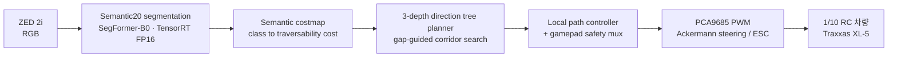

# ADOM: Autonomous Driving for Off-Road Military Vehicles

[English](README_en.md)

MUM-T(유무인 복합체계) 산악 오프로드 작전 환경을 위한 **카메라 단독 인지 기반 자율주행** 연구.
LiDAR 없이 RGB 한 장에서 지형을 의미 분할하고, 이를 semantic costmap과 로컬 플래너로 연결해
1/10 스케일 RC 차량이 비정형 오프로드를 주행한다.

**ADOM** studies camera-only off-road autonomy for MUM-T (Manned-Unmanned Teaming):
domain-adapted semantic segmentation on an embedded GPU, wired end-to-end into
semantic costmapping, local planning, and Ackermann control.

## 이 저장소가 담고 있는 것

- **데이터셋 전처리**: RELLIS-3D, RUGD, YCOR, GOOSE, 그리고 자체 수집한 한국 오프로드
  데이터를 하나의 Semantic20 온톨로지로 통합하는 재현 가능한 변환 파이프라인
- **학습**: MMSegmentation 위에 얹은 SegFormer B0/B2/B5 2-stage 학습과 계약 검증 훅
- **평가**: 체크포인트에서 직접 재추론하는 논문용 평가기, 불확실성 분석, 실차 Go/Stop 평가
- **배포**: ONNX(opset 13, raw logits) → TensorRT FP16 → Jetson Orin Nano 8GB
- **제어**: ROS 2 Jazzy 워크스페이스 — 인지, costmap, 방향 트리 플래너, Ackermann/PWM 제어

## 시스템 파이프라인


```mermaid
flowchart LR
    A["ZED 2i<br/>RGB"] --> B["Semantic20 segmentation<br/>SegFormer-B0 · TensorRT FP16"]
    B --> C["Semantic costmap<br/>class to traversability cost"]
    C --> D["3-depth direction tree planner<br/>gap-guided corridor search"]
    D --> E["Local path controller<br/>+ gamepad safety mux"]
    E --> F["PCA9685 PWM<br/>Ackermann steering / ESC"]
    F --> G["1/10 RC 차량<br/>Traxxas XL-5"]
```

인지 노드는 `mono8` 마스크(ID `0..18`, ignore `255`)와 confidence, overlay, JSON 상태를
발행한다. 플래너는 costmap을 3-depth 방향 트리로 탐색해 corridor를 고르고, 컨트롤러가
`/cmd_vel`을 Ackermann 명령으로 변환한다. 자율주행 launch는 **PWM 출력 노드를 띄우지 않는
것이 기본**이며(`start_pca9685:=false`), 켜더라도 차량은 STOPPED로 시작해 게임패드 A 버튼을
눌러야 자율 명령이 전달된다.

## Semantic20 온톨로지

원 20개 클래스에서 void를 제외한 **train ID `0..18`, ignore `255`**를 프로젝트 전역 계약으로
쓴다. 전처리, 학습 config, ONNX 출력 채널, ROS 토픽이 모두 이 계약을 공유한다.

| ID | 클래스 | ID | 클래스 | ID | 클래스 |
| --- | --- | --- | --- | --- | --- |
| 0 | dirt | 7 | object | 14 | concrete |
| 1 | grass | 8 | asphalt | 15 | barrier |
| 2 | tree | 9 | building | 16 | puddle |
| 3 | pole | 10 | log | 17 | mud |
| 4 | water | 11 | person | 18 | rubble |
| 5 | sky | 12 | fence | 255 | ignore |
| 6 | vehicle | 13 | bush | | |

정의 위치는 [`src/adom/evaluation_semantic20.py`](src/adom/evaluation_semantic20.py),
색상 팔레트는 [`src/adom/perception/semantic20.py`](src/adom/perception/semantic20.py),
소스 데이터셋에서 Semantic20으로 가는 매핑은
[`src/data/semantic_20/config/`](src/data/semantic_20/config/)에 있다.

기존 Cost4(`0..3`) 계약은 학습·평가 쪽에만 reference로 보존한다. ROS 인지 경로는
[결정 기록 0046](docs/decision-records/0046-retire-the-cost4-ros-path.md)에서 제거했다.

## 데이터셋과 실험 축

### 학습 데이터 구성

| 실험 | 학습 데이터 | 비고 |
| --- | --- | --- |
| `e0` | RELLIS-3D only | source-only 기준선 |
| `e1` | RELLIS-3D + RUGD + YCOR | 통합 패키지, manifest 14,421 샘플 |
| `e2` | E1 + GOOSE (direct-only) | source 다양성 확장 |
| `eadom` | E1 + 자체 수집 한국 오프로드 라벨 | **target-domain supervision** |
| `ta0` | target adaptation recipe discovery | crop/sampling/loss/optimizer ablation |

**핵심 계약: validation과 test는 어느 실험에서든 canonical RELLIS 고정이다.** 학습 데이터만
바뀌므로 E0와 E-ADOM이 완전히 동일한 샘플 위에서 비교된다. Source별 validation split은
진단용이며 체크포인트 선택에 절대 참여하지 않는다.

### 모델 축과 학습 레시피

`B0 / B2 / B5` 세 capacity를 동일한 2-stage 레시피로 학습한다.

- **Stage 1**: MiT 백본 freeze, head-only, 4k iteration, LR `6e-4`
- **Stage 2**: Stage 1 가중치만 로드하고 optimizer reset, end-to-end 40k iteration,
  LR `6e-5`, early stopping

## 연구 질문과 현재 결과

중심 가설은 **"target-domain supervision이 model capacity의 효용을 활성화한다"**이다.
`{B0, B2} × {E0, E-ADOM}` 2x2 설계로 capacity와 supervision의 상호작용을 분리해 관찰하고,
B5로 capacity curve가 계속 오르는지 포화하는지 확인한다.

자체 수집 한국 오프로드 held-out에서 관측된 값:

| 모델 | Korean held-out mIoU | log IoU |
| --- | --- | --- |
| B0-E-ADOM | 56.96 | — |
| B2-E-ADOM | **95.49** | 96.77 |

> [!IMPORTANT]
> **이 수치는 일반화 성능이 아니라 diagnostic으로 읽어야 한다.**
>
> - held-out은 **61 frame**이며, 소수의 연속 sequence에서 추출됐다. 서로 다른 이미지지만
>   같은 장소, 조명, 카메라 위치의 연속 관측이라 통계적 독립성이 약하다. `n=61`인 독립
>   실험이 아니다.
> - **negative sequence가 없다.** 대상 물체가 아예 없는 장면에서 모델이 없는 장애물을
>   만들어내는지(false positive)를 측정하지 못한다. 실주행에서는 이쪽이 더 위험할 수 있다.
> - **co-occurrence sequence가 없다.** log와 rubble이 함께 놓인 장면에서 두 클래스가 서로
>   침범하는지 확인할 수 없다.
> - B2가 이미 95.5이므로 **diagnostic ceiling** 가능성이 있다. B5가 더 높게 나오더라도 그것이
>   실제 capacity 이득인지 기존 test의 천장 효과인지 이 지표만으로는 구분되지 않는다.
>
> 따라서 현재 로드맵의 최우선 과제는 B5 학습이 아니라, positive / negative / co-occurrence를
> 모두 포함하고 학습 데이터와 장소, 시점이 겹치지 않는 **독립 held-out(v2) 수집**이다.

### 로드맵

1. **Phase 1** — `B0/B2 x E0/E-ADOM`: supervision-conditional capacity effect 관측 *(완료)*
2. **Phase 2** — 독립 held-out v2 수집: positive, negative, co-occurrence 시퀀스
3. **Phase 3** — B5 학습으로 capacity curve의 증가/포화 판정
4. **Phase 4** — 결론이 seed에 민감하면 seed `42, 43, 44` 반복

최종 목표는 "SegFormer-B2가 좋다"가 아니라, 새로운 도메인에 적응할 때
**작은/중간 모델로 2x2 pilot → 독립 target 평가 → capacity 이득이 확인된 경우에만 large model**
이라는 **model-sizing protocol**을 제시하는 것이다.

## 빠른 시작

### 설치

```bash
python -m pip install --editable .
```

학습에는 MMSegmentation 스택이 추가로 필요하다
([`docker/requirements/openmmlab.txt`](docker/requirements/openmmlab.txt), [`Dockerfile`](Dockerfile)).

### 학습 1-cycle

데이터셋 checksum 검증, 학습, 체크포인트 선택, test, ONNX parity를 하나의 상태 파일로 묶어
실행한다.

```bash
bash scripts/run_semantic20_cycle.sh \
  --dataset /workspace/adom/datasets/processed/semantic20 \
  --experiment eadom \
  --models b0,b2 \
  --seed 42 \
  --output /workspace/adom/runs/$(date -u +%Y%m%dT%H%M%SZ)
```

`--experiment`는 `e0`, `e1`, `e2`, `eadom`, `ta0`, `ta1`, `ta2`를 받는다. B5 실행은
`--b5-go-decision`으로 go/no-go 판정 파일을 반드시 함께 넘겨야 한다
([템플릿](configs/adom/phase1_semantic20/b5-go-decision.template.json)).
자세한 절차는 [RunPod 1-cycle 문서](docs/runpod-one-cycle.md)에 있다.

### 배포

```bash
bash scripts/export_semantic20_onnx.sh        # opset 13, static 640x384, raw logits
bash scripts/package_semantic20_handoff.sh    # parity와 reference I/O 검증 후 패키징
bash scripts/build_semantic20_tensorrt.sh     # Jetson에서 FP16 engine 생성
bash scripts/validate_semantic20_tensorrt.sh  # engine을 ONNX reference I/O와 대조
```

### Jetson 실행

```bash
scripts/run_jetson_t4.sh eadom                # 프로파일 검증 후 인지 노드 실행
ros2 launch adom_bringup low_level_autonomy.launch.py \
  model_config:="$ADOM_MODEL_CONFIG" checkpoint:="$ADOM_CHECKPOINT"
```

실차 자율주행은 shadow, wheels-off 검증을 통과한 뒤에만 `start_pca9685:=true`를 붙인다.

## 저장소 구조

한 줄 요약: **`src/`가 두뇌, `ros2_ws/`가 차량에 붙는 껍데기, `configs/` + `scripts/` +
`docker/`가 학습 파이프라인, `data/` + `docs/` + `tests/` + `tools/`가 그 결과를 신뢰할 수
있게 만드는 증거다.**

### 1. 데이터

**[`data/`](data/README.md)** — 데이터 자체가 아니라 **데이터의 신원**만 담는다.
`splits/`(train/val/test 샘플 ID)와 `registry/`(데이터셋 배포본 메타데이터)만 Git이
추적하고, 실제 이미지·마스크는 절대 커밋하지 않는다. `captures/`, `autonomy_bags/` 같은
나머지 디렉터리는 `scripts/init_workspace.sh`가 실행 시점에 만든다.

**[`src/data/`](src/README.md)** — RELLIS-3D · RUGD · YCOR · Semantic20 **데이터셋 변환
스크립트**와 클래스 매핑. 아래 `src/adom/`과는 목적이 다르다.

**[`scripts/data/`](scripts/README.md)** — Semantic20 패키지 전처리 진입점.

**[`docs/datasets/`](docs/datasets/rellis3d-cost4.md)** — 데이터셋 계약과 클래스 매핑 문서.

### 2. 모델 학습

**[`configs/`](configs/README.md)** — MMSegmentation 스타일 SegFormer config.
`_base_/`(모델·데이터셋·스케줄·런타임 조각) → `phase1_semantic20/`(현재 주력, train ID
`0..18`) → `export/`, `runtime/`로 나뉜다. 최상위의 `segformer_*_rellis3d.py`는 Cost4
시절 reference다.

**[`src/`](src/README.md)** — **ROS에 의존하지 않는 로직 전부.** 설치되는 `adom` 패키지가
여기 있다.

| 하위 패키지 | 역할 |
| --- | --- |
| `adom/data/` | 전처리, 검증, 패키징 |
| `adom/mmseg/` | MMSeg 확장 (dataset, metric, hook, sampler) |
| `adom/runtime/` | 학습·배포 사이클과 계약 게이트, export |
| `adom/perception/`, `adom/autonomy/` | 인지·계획·제어 알고리즘 (레인 3에서 사용) |
| `adom/analysis/` | 불확실성 분석 |

**[`scripts/`](scripts/README.md)** — 위 로직을 실제로 돌리는 셸 진입점. 학습
사이클(`run_semantic20_cycle.sh`), ONNX export, TensorRT 엔진 빌드·검증, Jetson
실행(`run_jetson_t4.sh`), 워크스페이스 초기화.

**[`docker/requirements/`](docker/requirements/openmmlab.txt)** — RunPod 학습 이미지의
**핀 고정된 의존성**. [`Dockerfile`](Dockerfile)이 COPY하는 대상이다. mmcv·mmdeploy·
protobuf·OpenCV의 버전 충돌을 피하려고 `--no-deps` 부트스트랩용으로 손수 고정한
목록이라, 사실상 "이 조합만 동작한다"는 계약 문서다.

### 3. 인지 및 제어

**[`ros2_ws/`](ros2_ws/README.md)** — Jetson 온보드 ROS 2 Jazzy colcon 워크스페이스,
9개 패키지. `src/adom`을 감싸는 **얇은 어댑터**라는 것이 설계 원칙이다 — 알고리즘은
`src/`에 두고, 여기는 topic I/O·파라미터·워치독만 담당한다. ZED 2i RGB → Semantic20
분할 → semantic costmap → 방향 트리 플래너 → 경로 추종 → 게임패드 안전 mux →
PCA9685 PWM.

**[`docs/jetson-shortcuts.md`](docs/jetson-shortcuts.md)** — Jetson 현장 운영 단축 명령.

### 공통

**[`docs/`](docs/README.md)** — `decision-records/`(ADR, 되돌리기 비싼 결정의 원문 보존),
`system-architecture/`, `setup-guides/`, `metrics/`, `datasets/`.

**[`tests/`](tests/)** — 단위 테스트라기보다 **계약 검증**에 가깝다. 데이터셋 행 수,
체크포인트 SHA, config 상속, 런타임 파라미터 값을 단언해 결과가 조용히 어긋나는 것을
fail-closed로 막는다. CI 워크플로 2개가 여기에 의존한다.

**[`tools/`](tools/paper_eval/README.md)** — 오프라인 평가 도구.

| 도구 | 역할 |
| --- | --- |
| [`paper_eval/`](tools/paper_eval/README.md) | 저장된 metric을 표에 복사하지 않고 **체크포인트에서 직접 재추론**해 논문 비교표를 재생성한다. 감사 리포트가 `PASS`가 아니면 시작조차 하지 않는다 |
| [`rc_eval/`](tools/rc_eval/README.md) | 실차 Go/Stop 시험 로깅. **구독·읽기 전용**이라 모터·서보 명령을 절대 발행하지 않는다 |
| `paper_submission_audit/` | 제출 감사 |

### 규칙

- `src/`는 ROS와 독립적인 재사용 로직을 담고, `ros2_ws/`의 노드는 이를 감싸는 adapter다.
- `tests/`는 CI에서 `python -m unittest discover -s tests`로 전부 실행된다.
- 대용량 데이터셋, 학습 결과, checkpoint, TensorRT engine은 git에 올리지 않는다.
- 로컬 `models/` 디렉터리는 Git 추적 대상이 아니며, 배치 규칙은
  [`docs/setup-guides/jetson-model-checkpoint-handoff.md`](docs/setup-guides/jetson-model-checkpoint-handoff.md)를 따른다.

## 재현성과 안전 장치

이 저장소는 결과가 조용히 어긋나지 않도록 여러 지점에서 fail-closed로 막는다.

- **데이터셋 정체성**: manifest 행 수와 source별 샘플 수를 학습 시작 전에 검증한다.
  E1이 14,421행이 아니면 사이클이 시작되지 않는다.
- **체크포인트 정체성**: 배포 프로파일은 `.pth`의 SHA-256을 확인하며, 의도적인 신규 artifact는
  `ADOM_EXPECTED_CHECKPOINT_SHA256`을 명시해야 통과한다.
- **평가 fail-closed**: [`tools/paper_eval`](tools/paper_eval/README.md)은 감사 리포트와
  환경/체크포인트/데이터셋 manifest가 모두 `PASS`가 아니면 실행되지 않는다. 저장된 지표를
  표에 복사하지 않고 항상 체크포인트에서 재추론한다.
- **B5 게이트**: B5는 go/no-go 판정 파일 없이 시작할 수 없고, 템플릿 기본값은 `NO_GO`다.
- **저장소 가드**: `python scripts/check_git_artifacts.py`가 데이터, 체크포인트, 엔진, 로그와
  개인 절대경로의 커밋 유입을 차단한다. CI에서 항상 실행된다.
- **실차 안전**: 자율주행 launch는 PWM 노드 없이 시작하고, 게임패드 safety mux를 통과해야
  명령이 전달된다. `/emergency_stop`과 command timeout은 `adom_control`이 직접 처리한다.
  워치독 계층 전체는 [`ros2_ws/README.md`](ros2_ws/README.md)에 정리돼 있다. `tools/rc_eval`은 구독 전용으로 어떤 명령도
  발행하지 않는다.

## 문서

- [Docs hub](docs/README.md)
- [System architecture overview](docs/system-architecture/overview.md)
- [Development setup guide](docs/setup-guides/development.md)
- [Benchmark protocol](docs/metrics/benchmark-protocol.md)
- [RELLIS-3D Cost4 data contract](docs/datasets/rellis3d-cost4.md)
- [RunPod training and DevOps guide](docs/devops.md) and [one-cycle command](docs/runpod-one-cycle.md)
- [Decision records](docs/decision-records/README.md) — 실험 설계와 주요 결정의 근거
- [RC vehicle (Traxxas XL-5) setup](docs/setup-guides/rc-vehicle-esc.md) and [Jetson shortcut commands](docs/jetson-shortcuts.md)
- [Contribution guide](.github/CONTRIBUTING.md)

## 데이터셋 출처

RELLIS-3D, RUGD, YCOR, GOOSE는 각 배포처의 라이선스와 이용 약관을 따른다. 이 저장소는
원본 데이터를 재배포하지 않으며 변환 코드와 split 정의만 포함한다. 자체 수집한 한국 오프로드
데이터의 공개 범위는 별도로 정한다.

## License

[MIT](LICENSE)
