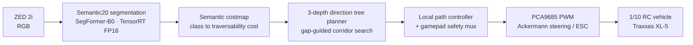

# ADOM: Autonomous Driving for Off-Road Military Vehicles

[한국어](README.md)

ADOM studies **camera-only autonomy for unstructured off-road terrain** in a MUM-T
(Manned-Unmanned Teaming) setting. Without LiDAR, a single RGB frame is segmented into
terrain semantics, turned into a traversability costmap, and driven through a local
planner on a 1/10-scale RC platform.

## What is in this repository

- **Dataset preprocessing** — a reproducible conversion pipeline that unifies RELLIS-3D,
  RUGD, YCOR, GOOSE, and our own Korean off-road captures into one Semantic20 ontology
- **Training** — SegFormer B0/B2/B5 two-stage training on top of MMSegmentation, with
  contract-verification hooks
- **Evaluation** — a paper evaluator that always re-infers from checkpoints, uncertainty
  analysis, and on-vehicle Go/Stop trial logging
- **Deployment** — ONNX (opset 13, raw logits) to TensorRT FP16 on Jetson Orin Nano 8GB
- **Control** — a ROS 2 Jazzy workspace: perception, costmap, direction-tree planner, and
  Ackermann/PWM control

## System pipeline



The perception node publishes a `mono8` mask (IDs `0..18`, ignore `255`) alongside
confidence, overlay, and a JSON status topic. The planner searches the costmap with a
3-depth direction tree to pick a corridor, and the controller converts `/cmd_vel` into
Ackermann commands. The autonomy launch **does not start the PWM node by default**
(`start_pca9685:=false`), and even with it enabled the vehicle starts STOPPED until an
operator presses the gamepad A button.

## Semantic20 ontology

The project-wide contract is **train IDs `0..18` with ignore `255`** — the original 20
classes minus void. Preprocessing, training configs, ONNX output channels, and ROS topics
all share this contract.

| ID | Class | ID | Class | ID | Class |
| --- | --- | --- | --- | --- | --- |
| 0 | dirt | 7 | object | 14 | concrete |
| 1 | grass | 8 | asphalt | 15 | barrier |
| 2 | tree | 9 | building | 16 | puddle |
| 3 | pole | 10 | log | 17 | mud |
| 4 | water | 11 | person | 18 | rubble |
| 5 | sky | 12 | fence | 255 | ignore |
| 6 | vehicle | 13 | bush | | |

Defined in [`src/adom/evaluation_semantic20.py`](src/adom/evaluation_semantic20.py); the
color palette lives in [`src/adom/perception/semantic20.py`](src/adom/perception/semantic20.py),
and source-to-Semantic20 mappings in [`src/data/semantic_20/config/`](src/data/semantic_20/config/).

The earlier Cost4 (`0..3`) contract is preserved separately for Phase 2 and reference use.

## Datasets and experiment axes

### Training data composition

| Experiment | Training data | Note |
| --- | --- | --- |
| `e0` | RELLIS-3D only | source-only baseline |
| `e1` | RELLIS-3D + RUGD + YCOR | combined package, 14,421 manifest rows |
| `e2` | E1 + GOOSE (direct-only) | wider source diversity |
| `eadom` | E1 + our labeled Korean off-road captures | **target-domain supervision** |
| `ta0` | target adaptation recipe discovery | crop/sampling/loss/optimizer ablation |

**Key contract: validation and test are always the canonical RELLIS splits**, in every
experiment. Only the training split changes, so E0 and E-ADOM are compared on identical
samples. Per-source validation splits are diagnostic artifacts and never participate in
checkpoint selection.

### Model axis and training recipe

`B0 / B2 / B5` are trained under one shared two-stage recipe.

- **Stage 1** — freeze the MiT backbone, head-only, 4k iterations, LR `6e-4`
- **Stage 2** — load Stage 1 weights only and reset the optimizer, end-to-end for 40k
  iterations, LR `6e-5`, early stopping

## Research question and current results

The central hypothesis is that **target-domain supervision activates the benefit of model
capacity**. A `{B0, B2} × {E0, E-ADOM}` 2x2 design isolates the interaction between
capacity and supervision; B5 then tests whether the capacity curve keeps rising or
saturates.

Observed on our Korean off-road held-out set:

| Model | Korean held-out mIoU | log IoU |
| --- | --- | --- |
| B0-E-ADOM | 56.96 | — |
| B2-E-ADOM | **95.49** | 96.77 |

> [!IMPORTANT]
> **Read these numbers as a diagnostic, not as generalization performance.**
>
> - The held-out set is **61 frames** drawn from a small number of continuous sequences.
>   The images differ, but they are consecutive observations of the same place, lighting,
>   and camera pose, so statistical independence is weak. This is not `n=61` independent
>   trials.
> - There are **no negative sequences**. We cannot measure whether the model hallucinates
>   obstacles in scenes where the target object is absent — a false-positive mode that may
>   matter more in real driving.
> - There are **no co-occurrence sequences**. We cannot check whether log and rubble bleed
>   into each other when they appear together.
> - With B2 already at 95.5, a **diagnostic ceiling** is plausible. Even if B5 scores
>   higher, this metric alone cannot separate a genuine capacity gain from a ceiling
>   effect in the current test set.
>
> The top roadmap priority is therefore not B5 training but collecting an **independent
> held-out v2** that covers positive, negative, and co-occurrence conditions at locations
> and times disjoint from the training data.

### Roadmap

1. **Phase 1** — `B0/B2 x E0/E-ADOM`: observe the supervision-conditional capacity effect *(done)*
2. **Phase 2** — collect independent held-out v2: positive, negative, co-occurrence sequences
3. **Phase 3** — train B5 to decide whether the capacity curve rises or saturates
4. **Phase 4** — repeat over seeds `42, 43, 44` if conclusions prove seed-sensitive

The intended contribution is not "SegFormer-B2 is good" but a **model-sizing protocol**:
run a small/medium 2x2 pilot, evaluate on independent target conditions, and commit to a
large model only when a capacity benefit is actually demonstrated.

## Quick start

### Install

```bash
python -m pip install --editable .
```

Training additionally needs the MMSegmentation stack
([`requirements/openmmlab.txt`](requirements/openmmlab.txt), [`Dockerfile`](Dockerfile)).

### One training cycle

Dataset checksum verification, training, checkpoint selection, test, and ONNX parity are
bound together into a single state file.

```bash
bash scripts/run_semantic20_cycle.sh \
  --dataset /workspace/adom/datasets/processed/semantic20 \
  --experiment eadom \
  --models b0,b2 \
  --seed 42 \
  --output /workspace/adom/runs/$(date -u +%Y%m%dT%H%M%SZ)
```

`--experiment` accepts `e0`, `e1`, `e2`, `eadom`, `ta0`, `ta1`, `ta2`. A B5 run must also
pass `--b5-go-decision` with a go/no-go decision file
([template](configs/adom/phase1_semantic20/b5-go-decision.template.json)).
See the [RunPod one-cycle guide](docs/runpod-one-cycle.md) for the full procedure.

### Deployment

```bash
bash scripts/export_semantic20_onnx.sh        # opset 13, static 640x384, raw logits
bash scripts/package_semantic20_handoff.sh    # package after parity and reference I/O checks
bash scripts/build_semantic20_tensorrt.sh     # build the FP16 engine on the Jetson
bash scripts/validate_semantic20_tensorrt.sh  # compare the engine against ONNX reference I/O
```

### Running on the Jetson

```bash
scripts/run_jetson_t4.sh eadom                # verify the profile, then start perception
ros2 launch adom_bringup low_level_autonomy.launch.py \
  model_config:="$ADOM_MODEL_CONFIG" checkpoint:="$ADOM_CHECKPOINT"
```

Add `start_pca9685:=true` only after shadow and wheels-off validation have passed.

## Repository layout

```text
.
├── configs/     # SegFormer training/export/deployment configs (MMSeg style)
├── data/        # splits and manifests only; bulk data is never committed
├── docs/        # architecture, setup guides, benchmark definitions, decision records
├── external/    # attachment point for third-party open source
├── models/      # checkpoint and export placement rules; no model files committed
├── ros2_ws/     # ROS 2 Jazzy colcon workspace (9 packages)
├── scripts/     # training, export, and Jetson operation entry points
├── src/         # preprocessing, training extensions, inference, evaluation, autonomy
├── tests/       # data, evaluation, and runtime contract tests
└── tools/       # paper evaluation, RC trial evaluation, submission audit
```

Per-directory detail lives in each README:
[configs](configs/README.md) ·
[data](data/README.md) ·
[docs](docs/README.md) ·
[external](external/README.md) ·
[models](models/README.md) ·
[ros2_ws](ros2_ws/README.md) ·
[scripts](scripts/README.md) ·
[src](src/README.md) ·
[tools/paper_eval](tools/paper_eval/README.md) ·
[tools/rc_eval](tools/rc_eval/README.md)

- `src/` holds ROS-independent reusable logic; nodes in `ros2_ws/` are adapters over it.
- `tests/` runs in full on CI via `python -m unittest discover -s tests`.
- Bulk datasets, training outputs, checkpoints, and TensorRT engines stay out of git.

## Reproducibility and safety gates

The repository fails closed at several points so results cannot drift silently.

- **Dataset identity** — manifest row counts and per-source sample counts are verified
  before training starts. A cycle refuses to run if E1 is not 14,421 rows.
- **Checkpoint identity** — deployment profiles check the SHA-256 of the `.pth`, and a
  deliberate new artifact must declare `ADOM_EXPECTED_CHECKPOINT_SHA256`.
- **Fail-closed evaluation** — [`tools/paper_eval`](tools/paper_eval/README.md) refuses to
  start unless the audit report and the environment, checkpoint, and dataset manifests all
  report `PASS`. It never copies a stored metric into a table; it re-infers from the
  checkpoint every time.
- **B5 gate** — B5 cannot start without a go/no-go decision file, and the template
  defaults to `NO_GO`.
- **Repository guard** — `python scripts/check_git_artifacts.py` blocks datasets,
  checkpoints, engines, logs, and personal absolute paths from entering git. It runs on
  every CI job.
- **Vehicle safety** — the autonomy launch starts without the PWM node, a gamepad safety
  mux gates autonomy, and `adom_control` owns `/emergency_stop` and command timeouts. The
  full watchdog chain is documented in [`ros2_ws/README.md`](ros2_ws/README.md).
  `tools/rc_eval` is subscribe-only and never publishes a command.

## Documentation

- [Docs hub](docs/README.md)
- [System architecture overview](docs/system-architecture/overview.md)
- [Development setup guide](docs/setup-guides/development.md)
- [Benchmark protocol](docs/metrics/benchmark-protocol.md)
- [RELLIS-3D Cost4 data contract](docs/datasets/rellis3d-cost4.md)
- [RunPod training and DevOps guide](docs/devops.md) and [one-cycle command](docs/runpod-one-cycle.md)
- [Decision records](docs/decision-records/README.md) — rationale for experiment design and key decisions
- [RC vehicle (Traxxas XL-5) setup](RC_SETTING.md) and [Jetson shortcut commands](SHORTCUT.md)
- [Contribution guide](CONTRIBUTING.md)

## Dataset attribution

RELLIS-3D, RUGD, YCOR, and GOOSE remain under their respective licenses and terms of use.
This repository redistributes no source data — only conversion code and split definitions.
The release scope of our own Korean off-road captures is decided separately.

## License

[MIT](LICENSE)
