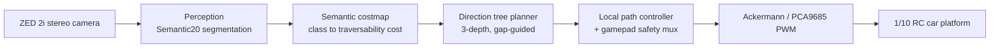

# System Architecture Overview

## Mission

산악 오프로드 환경에서 통신 지원 없이 온보드 자원만으로 지형을 인지하고 주행 의사결정에
연결한다. 센서는 카메라 단독이며 LiDAR를 쓰지 않는다.

## Scope

인지 정확도 benchmark와 실차 주행이 분리된 목표가 아니다. 동일한 Semantic20 계약이 전처리,
학습, ONNX export, TensorRT engine, ROS 토픽까지 관통하며, 한쪽에서 계약이 어긋나면 사이클이
시작되지 않도록 막는다.

## High-Level Pipeline

## Perception

- 모델: SegFormer (MiT 백본) B0 / B2 / B5
- 온톨로지: Semantic20 train ID `0..18`, ignore `255`
- 학습: Stage 1 head-only 4k iteration (LR `6e-4`) → Stage 2 end-to-end 40k iteration
  (LR `6e-5`, optimizer reset, early stopping)
- 배포 경로: PyTorch/MMSeg 체크포인트 → ONNX (opset 13, static `640x384`, raw logits)
  → TensorRT FP16 engine
- 출력 계약: `mono8` mask (`0..18` 또는 `255`), confidence, overlay, JSON status

Cost4(`0..3`) 경로는 별도 토픽과 launch로 보존하며 Semantic20 마스크와 섞지 않는다.

## Domain adaptation

Source-only 학습(E0, RELLIS-3D)과 target supervision을 더한 학습(E-ADOM)을 동일한 canonical
RELLIS validation/test 위에서 비교한다. 학습 split만 바뀌므로 capacity(B0/B2/B5)와
supervision의 상호작용을 분리해 관찰할 수 있다. 실험 축 정의는 루트
[README](../../README.md)를, 사전등록 계약은 [decision records](../decision-records/README.md)를
따른다.

## Mapping, planning, control

- **Costmap**: Semantic20 클래스를 traversability cost로 변환. lethal-only inflation을 쓰며
  clock domain 경계를 명시적으로 관리한다.
- **Planner**: 3-depth 방향 트리에 gap-guided corridor 탐색을 결합한다. 기본 corridor
  half-width `0.18 m`, lookahead `3.0 m`, unknown cost `70`, lethal cost `90`.
- **Control**: `/cmd_vel`을 Ackermann 명령으로 변환하고 PCA9685로 PWM을 출력한다. 제자리
  회전은 Ackermann 차량에서 불가능하므로 controller와 recovery에서 비활성화한다.
- **Localization/Nav2**: ZED VIO + RTK GNSS dual-EKF, Smac Hybrid-A* global,
  Regulated Pure Pursuit local. 긴 GPS route는 가까운 waypoint를 순차 전송한다.

## Integration

- ROS 2 Jazzy on Ubuntu 24.04 Noble
- Jetson Orin Nano 8GB 온보드 추론
- ZED 2i image / depth / IMU 입력
- mono repo 안의 colcon workspace (`ros2_ws/`, 9개 패키지)
- 표준 ROS 메시지만 사용

## Metrics

| Area | Metric |
| --- | --- |
| Segmentation | mIoU, class IoU, per-class recall/precision, absent-class false positive |
| Runtime | FPS, latency p50/p95, GPU memory |
| Edge deployment | Jetson Orin Nano 8GB power draw, TensorRT build time, engine size |
| Mapping | costmap update rate, source age tolerance |
| Autonomy trial | Go/Stop 판정 정확도, intervention count, recovery success |

정의와 측정 조건은 [benchmark protocol](../metrics/benchmark-protocol.md)을 따른다.
평가 수치는 저장된 값을 복사하지 않고 [`tools/paper_eval`](../../tools/paper_eval/README.md)이
체크포인트에서 재추론해 생성한다.

## Safety boundaries

- PCA9685 PWM 출력은 기본 비활성. 게임패드 safety mux를 통과해야 명령이 차량에 전달된다.
- `/emergency_stop`과 command timeout은 `adom_control`이 직접 처리한다.
- 상위 bringup은 센서, TF, localization이 검증될 때까지 autonomous planning을 비활성화한다.
- 평가 도구(`tools/rc_eval`)는 구독 전용이며 어떤 명령도 발행하지 않는다.
