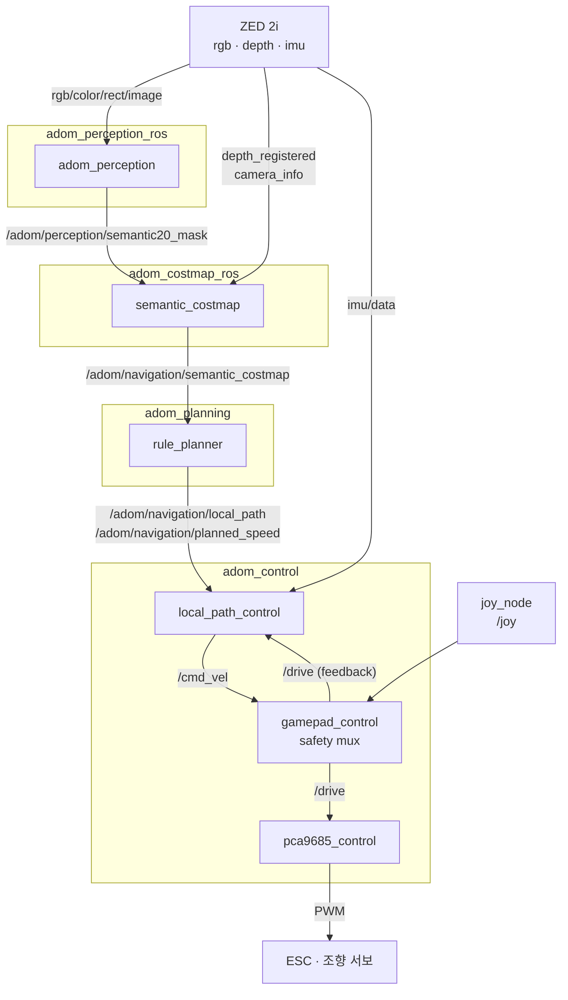

# ROS 2 Workspace

이 mono repo 안에서 관리하는 ROS 2 **Jazzy** (Ubuntu 24.04 Noble) colcon 워크스페이스다.
ZED 2i RGB 한 장에서 Semantic20 의미 분할을 수행하고, semantic costmap과 방향 트리
플래너를 거쳐 1/10 스케일 Ackermann RC 차량을 구동하는 전체 온보드 스택이 여기에 있다.

> **저작권자:** 이명섭 (leemyungsub@hanyang.ac.kr)
> 이 워크스페이스(`ros2_ws/`)의 ROS 2 패키지, 노드, launch, 설정은 위 저자가 작성했다.
> 저장소 전체 라이선스는 [MIT](../LICENSE)를 따른다.

## 설계 원칙

- **알고리즘은 `src/adom`, ROS는 어댑터.** 추론 backend, costmap 투영, 플래너 탐색,
  경로 추종, IMU 속도 추정, 스턱 복구는 모두 저장소 루트의 [`src/adom`](../src/README.md)에
  ROS 의존성 없이 구현돼 있다. 여기의 노드는 topic I/O, 파라미터, 워치독, 상태 발행만
  담당한다. 덕분에 주행 로직을 ROS 없이 오프라인에서 테스트할 수 있다.
- **표준 메시지만 사용.** 커스텀 `.msg` 패키지가 없다. 진단 정보는 `std_msgs/String`에
  JSON으로 실어 보낸다 (`/adom/**/status`).
- **모든 소비자는 워치독을 가진다.** 상류가 죽거나 늦으면 하류는 스스로 정지 상태로
  떨어진다. 아무 노드도 "마지막 명령"을 무한히 유지하지 않는다.
- **정지가 기본값.** 게임패드는 STOPPED로 시작하고, 플래너는 0 명령으로 시작하며,
  컨트롤러는 경로와 IMU가 도착할 때까지 0을 낸다.

## 데이터 흐름



TF(`base_link`, `zed_camera_link`, `gnss_link`)는 `adom_description`이, GNSS/EKF는
`adom_localization`이 공급한다. GPS는 **기록 전용**이며 저수준 자율주행의 제어 입력으로
쓰이지 않는다.

## 패키지

| 패키지 | 빌드 | 역할 |
| --- | --- | --- |
| `adom_description` | ament_cmake | 차량 URDF, 센서 TF, 섀시 CAD 메시 |
| `adom_sensors` | ament_cmake | ZED 2i, RTK GNSS 드라이버 launch/config |
| `adom_perception_ros` | ament_cmake | Semantic20 추론 노드, 마스크 컬러라이저, Cost4 레거시 경로 |
| `adom_costmap_ros` | ament_cmake | 마스크+depth를 traversability costmap으로 투영 |
| `adom_localization` | ament_cmake | ZED VIO + RTK GNSS dual-EKF (`robot_localization`) |
| `adom_planning` | ament_cmake | 방향 트리 로컬 플래너, Nav2 설정, RTK waypoint executor |
| `adom_control` | ament_python | 경로 추종, 게임패드 안전 mux, PCA9685 PWM, 데이터 레코더 |
| `adom_logging` | ament_python | GPS trail, autonomy rosbag 세션 (기록 전용) |
| `adom_bringup` | ament_cmake | 상위 launch 조합과 RViz 설정 |

## 노드 상세

### `adom_perception` — Semantic20 추론

[`adom_perception_ros/scripts/perception_node.py`](src/adom_perception_ros/scripts/perception_node.py)

MMSeg 체크포인트를 CUDA에서 실행한다. **구독 콜백에서 추론하지 않는다.** 프레임을
`LatestItemMailbox`(최신 1장만 유지)에 넣고 별도 워커 스레드가 소비하므로, 추론이
카메라 프레임률보다 느려도 큐가 자라지 않고 항상 최신 프레임을 처리한다. 버려진 프레임
수는 `overwritten_frames`로 보고된다.

| | |
| --- | --- |
| 구독 | `/zed/zed_node/rgb/color/rect/image` (BEST_EFFORT, depth 1) |
| 발행 | `/adom/perception/semantic20_mask` `mono8` ID `0..18`/`255` |
| | `/adom/perception/semantic20_mask_evidence` (기본 2 Hz, 구독자 있을 때만) |
| | `/adom/perception/semantic20_overlay_evidence` (2 Hz, 구독자 있을 때만) |
| | `/adom/perception/confidence` `mono8`, `/adom/perception/overlay` `bgr8` |
| | `/adom/perception/status` JSON — latency 분해, FPS, 클래스별 픽셀 통계 |
| 핵심 파라미터 | `config_path`, `checkpoint_path` (필수), `device=cuda:0`, `target_fps=30`, `evidence_mask_fps=2.0` |

confidence와 overlay는 **구독자가 있을 때만 계산한다**(`get_subscription_count()`).
RViz를 닫으면 컬러라이즈 비용이 자동으로 사라진다.

`status`는 `capture_to_receive_ms`, `capture_to_inference_start_ms`, `inference_ms`,
`capture_to_perception_output_ms`로 지연을 단계별로 분해해 병목 위치를 특정할 수 있다.

### `semantic_costmap` — 의미 기반 비용 지도

[`adom_costmap_ros/scripts/semantic_costmap_node.py`](src/adom_costmap_ros/scripts/semantic_costmap_node.py)

마스크와 registered depth를 카메라 내부 파라미터로 3D 역투영하고, TF로 `base_link`에
옮긴 뒤 robot-centric `OccupancyGrid`로 래스터화한다.

| | |
| --- | --- |
| 구독 | 마스크, `/zed/zed_node/depth/depth_registered`, `.../camera_info` |
| 발행 | `/adom/navigation/semantic_costmap` `nav_msgs/OccupancyGrid` |
| | `/adom/navigation/costmap_status` JSON |
| 기본 격자 | 전방 8.0 m x 폭 6.0 m, 해상도 0.10 m, `base_link` 원점 |

동작 특성:

- **시간 동기화**: depth를 15장 버퍼에 두고 마스크 stamp와 가장 가까운 것을 고른다.
  `max_sync_error_sec=0.35`를 넘으면 `waiting`을 발행하고 격자를 만들지 않는다.
- **높이 필터**: optical frame Y를 직접 쓰지 않고 TF로 변환한 `base_link` Z를 쓴다.
  `geometric_obstacle_min_height_m=0.10` 이상이면 클래스와 무관하게 비용 100.
- **빈 격자 원인 진단**: 관측 셀이 0일 때 `no_depth_in_range`, `no_depth_with_semantic_label`,
  `height_filter`, `outside_costmap`, `rasterization` 중 하나를 `empty_reason`으로 특정한다.
  현장에서 "costmap이 비어 있다"를 추측 없이 좁힐 수 있다.
- **클럭 도메인 경계**: 마스크/depth 동기화와 TF 조회까지는 카메라 stamp를 유지하고,
  출력 `OccupancyGrid`의 stamp에서 플래너의 ROS 클럭으로 명시적으로 넘어간다.

### `rule_planner` — 3-depth 방향 트리 플래너

[`adom_planning/scripts/rule_planner.py`](src/adom_planning/scripts/rule_planner.py)

costmap 위에서 Ackermann 기구학을 따르는 후보 경로를 트리로 펼쳐 corridor를 고른다.
레벨당 5개 조향(`-24, -12, 0, +12, +24°`), 깊이 3.

| | |
| --- | --- |
| 구독 | `/adom/navigation/semantic_costmap` |
| 발행 | `/adom/navigation/local_path` `nav_msgs/Path` (`base_link`) |
| | `/adom/navigation/planned_speed` `std_msgs/Float32` |
| | `/adom/navigation/rule_path` `Marker` (RViz), `/adom/navigation/rule_status` JSON |
| | `/adom/navigation/action_latency` JSON — 카메라 stamp에서 첫 명령까지 p50/p95 |
| | `/cmd_vel` — **기본 비활성** (`publish_cmd_vel: false`) |
| 주기 | 50 Hz |

입력 검증과 상태 기계:

- 격자 크기가 `width*height`와 다르면 거부한다.
- `max_source_age_sec=0.40`을 넘거나 미래(-0.10초 이상)인 costmap을 거부한다.
- `costmap_timeout_sec=0.20` 워치독 — 갱신이 끊기면 `stopped/costmap_watchdog`.
- 관측 셀이 하나도 없으면 `stopped/empty_costmap`.
- **BLOCKED 디바운스**: 장애물을 만나면 즉시 BLOCKED로 래치하고, 해제하려면 서로 다른
  costmap 3장이 연속으로 깨끗해야 한다. 50 Hz 타이머가 같은 격자를 반복해서 세지 않도록
  `_costmap_generation`으로 새 격자만 카운트한다.
- `side_cost_enabled`: 좌/우 절반의 총비용을 비교해 첫 조향을 고정하고 나머지 5²=25 경로만
  탐색한다. 이 보조 판단은 BLOCKED를 결정하지 않는다 — 선택된 경로의 clearance가 결정한다.

### `local_path_control` — 경로 추종

[`adom_control/adom_control/local_path_control.py`](src/adom_control/adom_control/local_path_control.py)

로봇 좌표계 경로를 GPS 없이 추종한다. **`/cmd_vel`의 소유자는 이 노드다.**

| | |
| --- | --- |
| 구독 | `/adom/navigation/local_path`, `/adom/navigation/planned_speed` |
| | `/zed/zed_node/imu/data`, `/drive` (실제 명령 피드백) |
| 발행 | `/cmd_vel` `geometry_msgs/Twist`, `/adom/control/local_path_status` JSON |
| 주기 | 50 Hz, 모든 입력 워치독 0.25 s |

- 경로 `frame_id`가 `base_link`가 아니면 거부한다.
- 휠 인코더가 없으므로 **IMU 종방향 가속도를 적분해 속도를 추정**한다. `/drive`가 0
  명령을 0.5초 이상 유지하면 정지로 보고 바이어스를 온라인 학습한다.
- **스턱 복구**: 회전 명령이 안정적으로 유지되는데 추정 속도와 yaw rate가 모두 낮으면
  0.75초 동안 한 번 높은 스로틀을 시도한다. 직진 중에는 발동하지 않는다 — 인코더 없이
  낮은 IMU 속도만으로는 정지와 등속을 구분할 수 없기 때문이다.

### `gamepad_control` — 안전 mux

[`adom_control/adom_control/gamepad_control.py`](src/adom_control/adom_control/gamepad_control.py)

수동/자율 입력 중 하나를 골라 **단일 `/drive` 명령**으로 내보내는 유일한 지점이다.

| | |
| --- | --- |
| 구독 | `/joy`, `/cmd_vel` (자율 입력, `autonomous_input_type=twist`) |
| 발행 | `/drive` `AckermannDriveStamped`, `/adom/control/mode` |
| 모드 | `stopped` (기본) · `manual` (X) · `autonomous` (A) · 정지 (B) |

- 버튼은 **rising edge**로만 반응해 눌림 유지로 모드가 반복 전환되지 않는다.
- 수동 모드는 **스틱이 중립일 때만 arm**된다. 스틱을 당긴 채 모드를 바꿔도 즉시
  튀어나가지 않는다.
- 모드 전환 시 저장된 수동 명령을 0으로 초기화한다.
- 자율 입력은 `max_forward/reverse_speed_mps`와 `max_steering_angle_deg`로 클램프된다.
- `Twist`의 `angular.z`는 `atan(wheelbase * ω / v)`로 조향각으로 환산된다. 메시지는
  라디안, 사용자 설정은 도(degree)다.

### `pca9685_control` — PWM 출력

[`adom_control/adom_control/pca9685_control.py`](src/adom_control/adom_control/pca9685_control.py)

`/drive`를 ESC/조향 서보 펄스폭으로 변환해 I²C PCA9685에 쓴다. **실제 하드웨어를
초기화하는 유일한 노드다.**

| | |
| --- | --- |
| 구독 | `/drive`, `/emergency_stop` `std_msgs/Bool` |
| 발행 | `/adom/control/pwm_us` `Float64MultiArray` (ESC µs, 조향 µs) |
| 하드웨어 | `/dev/i2c-7`, 주소 `0x40`, 50 Hz, ch0=ESC, ch1=조향 |

- 시작 시 중립 펄스를 쓴다. I²C 초기화 실패는 `fatal` 후 예외로 즉시 중단한다 —
  조용히 dry-run으로 넘어가지 않는다. 이 노드를 아예 띄우지 않으려면 launch에
  `start_pca9685:=false`를 넘긴다 (`control.launch.py`, `vehicle.launch.py`,
  `gamepad_control.launch.py`, `low_level_autonomy.launch.py` 모두 지원).
- 타이머 기반 ESC arming 유지 시간은 구현돼 있지 않다. ESC 전원은 이 노드가 PCA9685
  준비 완료를 로그로 보고한 뒤에 넣는다.
- `/emergency_stop true` 또는 명령 무수신 0.25초 → 중립.
- `enable_cmd_vel`은 기본 `false`. `/cmd_vel`을 직접 받으면 게임패드 mux를 우회하므로
  적절한 command mux 없이 켜지 않는다.

### 보조 노드

| 노드 | 패키지 | 역할 |
| --- | --- | --- |
| `semantic20_colorizer` | `adom_perception_ros` | `mono8` ID를 팔레트 색으로. 재추론하지 않고 ignore `255`는 검정 |
| `adom_cost4_perception_node` | `adom_perception_ros` | 레거시 Cost4 경로. Semantic20 토픽과 분리 유지 |
| `data_recorder` | `adom_control` | 게임패드 Y로 RGB 전용 rosbag 토글. 20 GB 상한, 1 GB 분할 |
| `autonomy_data_recorder` | `adom_logging` | autonomy 세션 자동 기록. 전대역 카메라 제외, 상태 토픽 위주 |
| `gps_track_logger` | `adom_logging` | `/fix` trail 시각화. **planning/control에 절대 투입하지 않음** |
| `rtk_waypoint_executor` | `adom_planning` | WGS84 waypoint를 map pose로 바꿔 Nav2 goal을 하나씩 전송 |

## 안전 계층

정지 권한이 여러 층에 중복돼 있고, 각 층은 상류를 신뢰하지 않는다.

| 층 | 조건 | 결과 |
| --- | --- | --- |
| `rule_planner` | costmap 0.20 s 무갱신 / 빈 costmap / 오래된 costmap | 속도 0, 빈 경로 |
| `rule_planner` | 선택 경로 clearance ≤ `stop_distance_m` | BLOCKED 래치, 깨끗한 costmap 3장 필요 |
| `local_path_control` | 경로·속도·IMU 중 하나라도 0.25 s 초과 | `/cmd_vel` 0 |
| `gamepad_control` | 모드가 `stopped`, 또는 자율 명령 0.25 s 초과 | `/drive` 0 |
| `gamepad_control` | 수동 모드에서 `/joy` 0.50 s 초과 | `/drive` 0 |
| `pca9685_control` | `/emergency_stop`, 또는 `/drive` 0.25 s 초과 | 중립 펄스 |
| 프로세스 종료 | 각 노드 `destroy_node()` | 0 명령 / 중립 펄스 발행 |

워치독 시간이 상류로 갈수록 짧다(0.20 < 0.25). 상류가 먼저 정지를 선언하므로 하류
타임아웃은 상류가 완전히 죽은 경우에만 발동한다.

## 빌드

```bash
source /opt/ros/jazzy/setup.bash
cd ~/ADOM/ros2_ws
colcon build --symlink-install
source install/setup.bash
```

Jetson에서는 의존성 설치와 빌드를 한 번에 처리한다.

```bash
bash scripts/install_jetson_control.sh
```

`build/`, `install/`, `log/`는 git에서 제외된다.

## 자율주행 풀스택 실행

모든 터미널에서 먼저 환경을 맞춘다. **`ROS_DOMAIN_ID`와 RMW 설정이 터미널마다 같아야
한다.** 다르면 노드가 서로 보이지 않는다.

```bash
source /opt/ros/jazzy/setup.bash
source ~/ADOM/ros2_ws/install/setup.bash
export ROS_DOMAIN_ID=0
export ADOM_REPO_ROOT="$HOME/ADOM"
```

### 1단계 — 센서와 TF

```bash
# 터미널 1
ros2 launch adom_sensors sensors.launch.py

# 터미널 2
ros2 launch adom_description description.launch.py
```

### 2단계 — 검증 (건너뛰지 않는다)

```bash
# 터미널 3
ros2 topic hz /zed/zed_node/rgb/color/rect/image
ros2 topic hz /zed/zed_node/depth/depth_registered
ros2 run tf2_tools view_frames          # base_link -> zed_camera_link 확인
```

카메라와 depth가 안정적으로 들어오고 TF 트리가 끊기지 않는 것을 확인한 뒤 진행한다.
ZED Wrapper가 자체 카메라 URDF를 발행하면 프레임 이름이 충돌할 수 있다.

### 3단계 — 자율주행 스택 (PWM 없이)

```bash
# 터미널 4
export ADOM_MODEL_CONFIG=~/ADOM/configs/adom/runtime/segformer_b0_640x384_eadom.py
export ADOM_CHECKPOINT=~/ADOM/models/checkpoints/eadom/<checkpoint>.pth

ros2 launch adom_bringup low_level_autonomy.launch.py \
  model_config:="$ADOM_MODEL_CONFIG" \
  checkpoint:="$ADOM_CHECKPOINT"
```

인지 + costmap + 플래너 + 컨트롤러 + 게임패드 mux + autonomy rosbag이 한 번에 뜬다.
이 launch는 `start_pca9685:=false`가 기본이라 **PWM 출력 노드가 실행되지 않는다.**
차량은 움직이지 않고 명령만 흐른다.

### 4단계 — 모니터링

```bash
# 터미널 5
ros2 topic echo /adom/perception/status --once      # FPS, 지연 분해
ros2 topic echo /adom/navigation/costmap_status     # empty_reason 확인
ros2 topic echo /adom/navigation/rule_status        # driving / blocked, 조향, clearance
ros2 topic echo /adom/control/local_path_status     # 추종 상태, 추정 속도
ros2 topic echo /adom/control/mode                  # stopped / manual / autonomous
```

`rule_status`가 `driving`이고 `costmap_status`가 `ok`이며 `local_path_status`가
`tracking`이면 명령 체인이 끝까지 연결된 것이다.

### 5단계 — 실제 주행 (바퀴 들고 먼저)

shadow 검증이 끝난 뒤에만 PWM을 켠다. **차량을 받침대에 올려 바퀴가 뜬 상태로 먼저
확인한다.**

```bash
ros2 launch adom_bringup low_level_autonomy.launch.py \
  model_config:="$ADOM_MODEL_CONFIG" \
  checkpoint:="$ADOM_CHECKPOINT" \
  start_pca9685:=true
```

프로세스가 올라와도 차량은 **STOPPED**로 시작한다. 게임패드에서:

| 버튼 | 동작 |
| --- | --- |
| **B** | 즉시 정지 (어느 모드에서든) |
| **X** | 수동 모드 — 스틱을 중립에 둬야 arm된다 |
| **A** | 자율 모드 — 이때부터 `/cmd_vel`이 `/drive`로 전달된다 |

긴급 시 `/emergency_stop`으로도 중립을 강제할 수 있다.

```bash
ros2 topic pub --once /emergency_stop std_msgs/Bool "{data: true}"
```

### RViz 포함 실행

```bash
ros2 launch adom_bringup rule_autonomy.launch.py \
  model_config:="$ADOM_MODEL_CONFIG" checkpoint:="$ADOM_CHECKPOINT"
```

### 데이터 수집만

```bash
ros2 launch adom_bringup data_collection.launch.py
```

게임패드 **Y**로 RGB 전용 rosbag을 토글한다. depth/GNSS/IMU/제어는 기록하지 않는다.

### Jetson 단축 진입점

프로파일 config/체크포인트 수와 SHA-256을 검증한 뒤 실행한다. 자세한 내용은
[`SHORTCUT.md`](../SHORTCUT.md).

```bash
scripts/run_jetson_t4.sh eadom
```

## 참고

- 패키지별 상세는 각 패키지의 README를 따른다.
- 차량 ESC 설정: [`RC_SETTING.md`](../RC_SETTING.md)
- Jetson 운영 단축 명령: [`SHORTCUT.md`](../SHORTCUT.md)
- 설계 근거: [decision records](../docs/decision-records/README.md)
