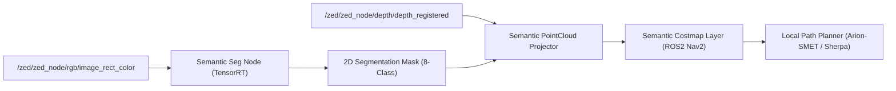

# ZED ROS2 Wrapper Setup & Sensor Pipeline Guide
**아리온스맷 / HR-셰르파 차륜형 무인차량 탑재 ZED 2i 스테레오 카메라 ROS2 설정 가이드**

---

## 1. 개요 및 하드웨어 구성

본 문서는 **대대급 탄약·보급품 수송 차륜형 다목적 무인차량(한화 아리온스맷 / 현대로템 HR-셰르파)**의 주 주행 인지 센서인 **ZED 2i 스테레오 카메라**를 ROS2 Humble 환경([stereolabs/zed-ros2-wrapper](https://github.com/stereolabs/zed-ros2-wrapper))에서 운용하기 위한 설정 및 아키텍처 가이드이다.

- **타겟 온보드 하드웨어**: NVIDIA Jetson Orin NX (16GB / 8GB)
- **타겟 프레임 속도**: 최소 30 FPS 실시간 인지 파이프라인 구동
- **운용 OS / 미들웨어**: Ubuntu 22.04 LTS + ROS2 Humble

---

## 2. 차량 장착 제약 및 FOV 설정 (Mount Configuration)

차륜형 보급 차량의 특성상 야지 주행 중 노면 전방의 굴곡, 물웅덩이, 큰 바위 등을 조기에 파악해야 한다.

```text
[ 탑재 플랫폼: Arion-SMET / HR-Sherpa 차륜형 6x6/4x4 ]
        +-------------------------+
        |   ZED 2i Stereo Camera  |  <-- 마운트 높이: 지면 기준 1.4m ~ 1.7m
        +------------+------------+      Pitch Down Angle: 12° ~ 15° 하향
                     |
         [ Front Cargo / Hood ]
                     |
      (Wheel)-----------------(Wheel)
========================================= [Off-Road Ground Terrain]
```

- **마운트 높이**: 1.4m ~ 1.7m (차량 전방 및 중거리 주행 노면 동시 확보)
- **하향 틸트 각도 (Pitch Angle)**: 12° ~ 15° 하향 마운트 권장
- **블라인드 스포트 보완**: 카메라 최하단 시야각 기준 차량 전방 1.5m 이후 노면부터 20m 전방까지 고르게 픽셀 밀도를 유지할 수 있도록 렌즈 옵션 및 마운트 위치 보정

---

## 3. ZED ROS2 Wrapper 권장 파라미터 구성 (`zed_camera.yaml`)

Jetson Orin NX의 AI 연산 리소스(Tensor Cores)를 인지 모델(SegFormer / YOLOv8-Seg TensorRT FP16)과 효율적으로 분배하기 위한 ZED 노드 설정이다.

```yaml
/**:
  ros__parameters:
    general:
      camera_model: 'zed2i'
      grab_resolution: 'HD720'          # 1280x720 권장 (연산 효율 및 30+ FPS 보장)
      grab_frame_rate: 30               # 최소 30 FPS 고정
      pub_frame_rate: 30.0              # ROS2 토픽 퍼블리시 속도
      gpu_id: 0

    depth:
      depth_mode: 'NEURAL'              # Orin NX Tensor Core 활용 Neural Depth 모드
      depth_stabilization: true         # 오프로드 노면 진동에 따른 Depth 튀는 현상 억제
      point_cloud_freq: 15.0            # Costmap 부하 조절을 위해 Point Cloud는 15Hz로 제한

    pos_tracking:
      pos_tracking_enabled: true        # ZED VIO (Visual Inertial Odometry) 활성화
      imu_fusion: true                  # 야지 주행 차량 흔들림 보정을 위한 IMU 퓨전
```

> [!TIP]
> **해상도 설정 이유 (`HD720` vs `HD1080`)**  
> `HD1080` 적용 시 실시간 주행 중 Neural Depth 연산과 TensorRT 기반 Semantic Segmentation 모델이 Orin NX의 메모리 대역폭을 과점유할 수 있다. 1차 벤치마크 단계에서는 **`HD720 @ 30FPS`**를 표준 입력 프로토콜로 채택한다.

---

## 4. ROS2 Topic 인터페이스 명세서

### 4.1 핵심 구독/발행 토픽 (Perception Input)
| Topic Name | Message Type | 용도 및 후속 노드 |
| :--- | :--- | :--- |
| `/zed/zed_node/rgb/image_rect_color` | `sensor_msgs/msg/Image` | Semantic Segmentation 추론 노드 입력 |
| `/zed/zed_node/depth/depth_registered` | `sensor_msgs/msg/Image` | 픽셀별 3D 공간 좌표 및 거리 투영 |
| `/zed/zed_node/point_cloud/cloud_registered` | `sensor_msgs/msg/PointCloud2` | 3D 지형 분석 및 ROS2 Nav2 Costmap 변환 |
| `/zed/zed_node/imu/data` | `sensor_msgs/msg/Imu` | 오프로드 노면 요철 통과 시 피치/롤 보정 |

### 4.2 인지 후속 파이프라인 (Perception-to-Costmap Bridge)



---

## 5. Mono Repo 내 관리 및 테스트 가이드

1. **저장소 통합 방안**:  
   외부 `zed-ros2-wrapper` 코드를 레포지토리 루트에 그대로 복사하지 않고, 모노 레포 내부의 `ros2_ws/src/` 아래에 공식 저장소를 **Git Submodule**로 연결하거나, `ros2_ws/src/adom_sensors/` 패키지에서 ZED Wrapper의 래퍼(Launch & Config Adapter) 노드만 구성한다.
2. **센서 오프라인 재현 테스트 (rosbag 플레이백)**:  
   - 실제 오프로드 주행에서 획득한 `rosbag`을 재생할 때는 시계열 동기화를 위해 `use_sim_time: true` 파라미터를 활성화하여 인지 모델과의 레이턴시 지표(`p50`, `p95`)를 측정한다.
